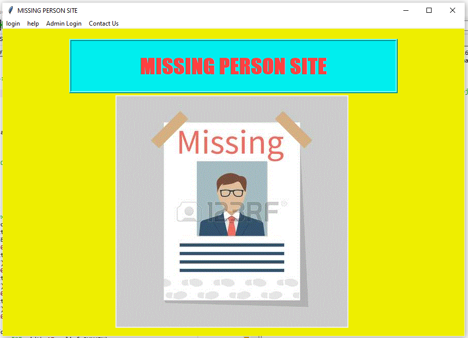
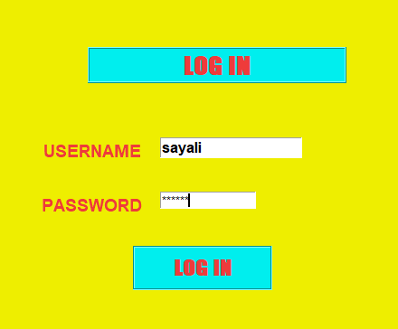
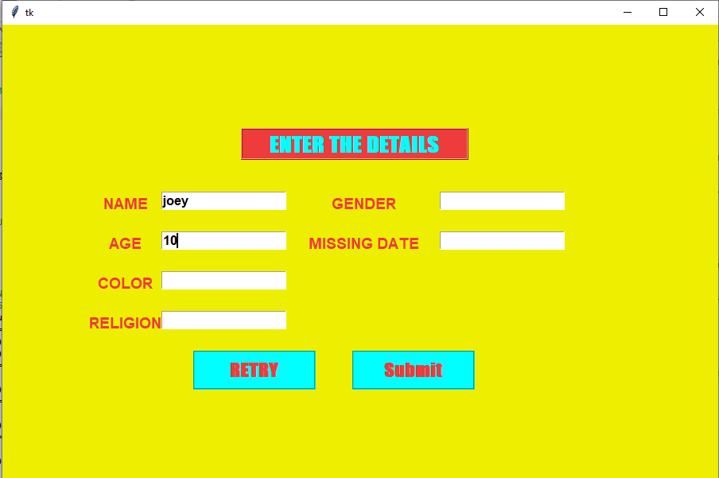

# Missing-Person-Site
Missing person site made using python, tkinter ,sqlite database to find and report missing persons' data
**Description:**  
1)This project consists of finctionalities such as login,signUp,Admin login,Find User,Enter details,help and about. 
2)It makes use of sqlite database to store the login information and  to store missing person's data. 
3)Only **admins** can can enter the data of a person in the database who is lost and has been found and reported to search for his relatives. 
4)Anyone can login and find if the missing person has been found by entering their details. 
5)If anyone finds the person and repoets to the admin, admin adds his deatils to the database. 
6)When a person is searched on the site, if person's details exist in the database (if added by admin),it is displayed as person found else not found.  

**Results:** 
1)Frontpage: 
 
2)Login: 
 
3)Enter Details(By admin): 
 
4)When logged in user searches for missing person: 
 
5)If Person is **Found**: 
 
6)Else if Person is **Not Found**: 
 

